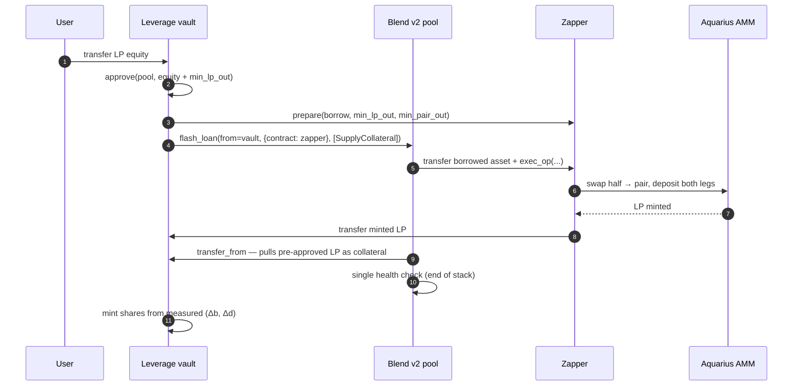
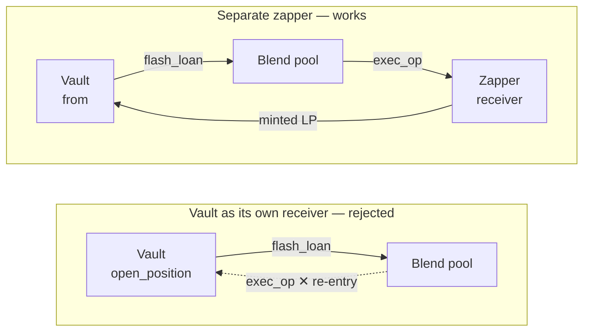
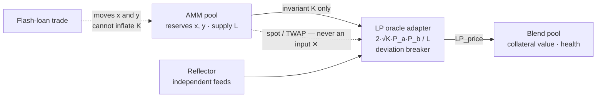

# Leveraged LP Farming on Stellar — architecture

Reference architecture for multiplying an Aquarius LP position in **one signed Soroban
transaction**, using the raw LP share token as collateral on a Blend v2 lending pool.

This repository is **documentation and interfaces only** — there is no implementation here. It
exists so the design, the failure modes and the contract surface can be read, reviewed and reused
without reading a working codebase. Every number and error code below was observed on-chain.

> **Status:** verified end-to-end on Stellar testnet, including liquidation. Not on mainnet, not
> audited. See [Known gaps](#known-gaps).

---

## The problem

Aquarius issues transferable SEP-41 LP share tokens. Blend v2 runs permissionless lending pools
with a `flash_loan` primitive. Both are live on Stellar; nothing connects them, so an LP position
is committed capital that cannot be borrowed against.

The connection is worth making only if it is atomic. Reaching a target leverage by looping
`supply → borrow → zap → supply` adds less leverage each pass, costs more in fees, and leaves the
position liquidatable *between* passes. A flash loan runs the health check exactly once, at the end
of the request stack, so the position is never observably unhealthy.

## The atomic open

```
open_position(user, collateral_lp, borrow_amount, min_lp_out, min_pair_out)
```



Guards on the path: a leverage cap in the vault, `min_lp_out` / `min_pair_out` slippage bounds in
the zapper, and Blend's own health check. Because it is one transaction, a failure anywhere means
nothing happened — the user keeps their LP and pays only the network fee.

## Why two contracts

The obvious design — one vault that is both the flash-loan initiator and the `exec_op` receiver —
**cannot work on Soroban.** The vault is still on the call stack inside `open_position` when the
pool calls back into it, and the host rejects the re-entry:

```
Error(Context, InvalidAction)
  → "Contract re-entry is not allowed"
```



Splitting `exec_op` onto a contract that is not already on the stack is the entire fix. This is the
most reusable finding here for anyone composing Blend flash loans.

Two further mechanics are easy to get wrong:

- `SupplyCollateral` pulls the LP by **`transfer_from`**, so the initiator must pre-approve the pool
  *before* the loan.
- The non-flash unwind's `Repay` is pulled by **`transfer`** with the vault as *spender*, which an
  allowance does not cover. It needs `authorize_as_current_contract` on that sub-invocation.

## Position accounting, and what "pooled" costs

The vault owns **one** Blend position. Depositors hold **shares** of it, and a user's position is
never stored as an amount — it is derived on read from live Blend state:

```
user_collateral = collateral_shares / total_collateral_shares
                  × pool.get_positions(vault).collateral[lp_reserve_index]

user_debt       = debt_shares / total_debt_shares
                  × pool.get_positions(vault).liabilities[borrow_reserve_index]
```

Shares are minted from the *measured* delta in the vault's bToken/dToken balances across the flash
loan, not from the requested amounts, so slippage and fees land on the depositor who caused them.
Interest accrues into the share price with nothing to reconcile — an earlier internal-ledger design
desynced the moment a liquidation touched the position.

**This is the Aave model, and the cost is specific:**

| Event | Who bears it |
| --- | --- |
| A depositor **voluntarily unwinds** | Only them. Shares burn from the measured delta, so the exit takes exactly their share and every other depositor's claim is unchanged. |
| A depositor's position is **liquidated** | **Everyone, pro-rata.** The penalty lands on the single Blend position, so every share loses value — including shares of depositors who were never over-levered. |

There is one position and one share price derived from it. That is what makes the accounting exact,
and it is exactly why a liquidation cannot be contained to the depositor who caused it. **This
design does not isolate liquidation losses.** An equity cap is the only mitigation until isolation
ships.

Two designs give real isolation:

- **User-owned Blend positions** — the user is Blend's `from` and the vault is only the flash-loan
  receiver. Isolation becomes structural, at the cost of a more complex client and per-user
  authorisation. The cheapest correct route.
- **Per-user sub-accounts** inside the vault, requiring a separate Blend position per depositor —
  materially heavier than a share ledger.

## Pricing the collateral

A lending market that misprices its collateral can be drained, so the rule is absolute: **the LP
price never reads the pool's own spot price or a TWAP of it.** It is computed from the pool
invariant and independent price feeds:

```
LP_price = 2 · √(K · P_a · P_b) / L        where K = x · y
```



An attacker can shove reserves around cheaply, which is what breaks a spot-priced LP collateral.
Moving `K` requires depositing real assets and leaving them, so the collateral price is not
tradeable. A stale or dislocated feed halts new borrowing rather than lending against a bad price.

**Prefer the pool's own quote where one exists.** If the AMM exposes an `estimate_swap`-style
read, use it as the primary reference: it is the contract's own number, with no amplification
convention or fee assumption of yours. Aquarius StableSwap pools expose `estimate_swap` and
`get_info` (live `a` and `fee`) — and because they also expose `ramp_a`, a hardcoded amplification
constant can go stale silently. Local math belongs in the fallback path only.

> Convention note, in case you implement the fallback: Curve's original `Ann = A · n` and the newer
> `A · n^n` differ by 2× at n=2. On a pool near balance both agree, so a balanced test proves
> nothing — validate against the contract on an *imbalanced* pool.

## Liquidation

Liquidation happens at the lending-pool level against the vault's position. The winning filler
unwinds atomically in one transaction:

```
win auction → withdraw LP through the AMM into both assets → swap one leg → repay the borrow
```

Observed on testnet, and all correct behaviour:

| Signal | Meaning |
| --- | --- |
| `#1214 InvalidLiqTooSmall` | A 50% auction was refused; 100% accepted. The pool evaluating health correctly. |
| `#1205 InvalidHf` | A fill at auction block 0 reverted — Dutch-auction protection. A real liquidator waits. |

A stale auction on the vault can be cleared by the vault itself (`DeleteLiquidationAuction` with
`from` = vault); the permissionless `del_auction` only applies after ~500 blocks.

## Failure modes worth publishing

Each of these cost real debugging time:

- **Soroban re-entrancy** when the initiator is its own flash-loan receiver. Fixed by the zapper
  split above.
- **Oracle TTL expiry.** When price entries expire under Soroban state TTL, *every* entrypoint
  reverts with an untyped host trap — `VM call trapped: UnreachableCodeReached` — not
  `PoolError::InvalidPrice (#1210)`, and **nothing in the trace names the oracle.** It looks like a
  vault bug. Check price freshness first.
- **Error codes collide across contracts.** `Error(Contract, #4)` is `LeverageTooHigh` in the vault
  and `SlippageExceeded` in the AMM. The trace's top frames name the caller; the truth is in the
  deepest diagnostic event. Always read to the bottom.
- **Quoting the zap wrong is fatal, not cosmetic.** A 50/50 zap swaps half the borrowed asset and
  mints roughly *half* as many LP shares as the borrowed amount. A floor set at ≈ the borrow amount
  can never be met, and every open reverts. Quote from live reserves.
- **Reserve timelock.** Adding or changing a reserve on a pool that has left setup costs a week
  (`#1203 InitNotUnlocked`). Configure everything during setup.

## Contract surface

Interfaces only, no implementations — see [`interfaces/`](interfaces/):

| File | What it defines |
| --- | --- |
| [`leverage_vault.rs`](interfaces/leverage_vault.rs) | The vault: open, unwind, views, admin |
| [`zapper.rs`](interfaces/zapper.rs) | The flash-loan receiver |
| [`lp_oracle_adapter.rs`](interfaces/lp_oracle_adapter.rs) | Fair-LP pricing surface |
| [`blend_pool.rs`](interfaces/blend_pool.rs) | The Blend v2 surface actually consumed |
| [`amm_pool.rs`](interfaces/amm_pool.rs) | The Aquarius surface actually consumed |

## Known gaps

Honest list, in the order they should be closed:

1. **Liquidation losses are pooled**, as described above. Isolation is a design change, not a patch.
2. **Leverage cap.** A cap above the lending pool's own liquidation boundary is not a cap — it
   wastes user gas discovering the real limit. It belongs at ~92% of `1 / (1 − c_factor × l_factor)`.
3. **Unwind requires the user to bring the repay asset.** A flash-loan self-closing path removes it.
4. **The oracle adapter is the highest-risk contract** in the design and needs its own manipulation
   test suite.
5. **Soroban footprint validation** of the full liquidation sequence — a liquidation that exceeds
   resource limits is an un-liquidatable position.
6. **Third-party audit** before any mainnet deployment.

## Related

- Blend v2 — <https://docs.blend.capital>
- Aquarius AMM — <https://aqua.network>
- Reflector oracles — <https://reflector.network>

---

Published by [WhaleHub](https://whalehub.io) so other teams do not repeat the failure modes above.
Nothing here is investment advice, and no figure is a projection of return.
